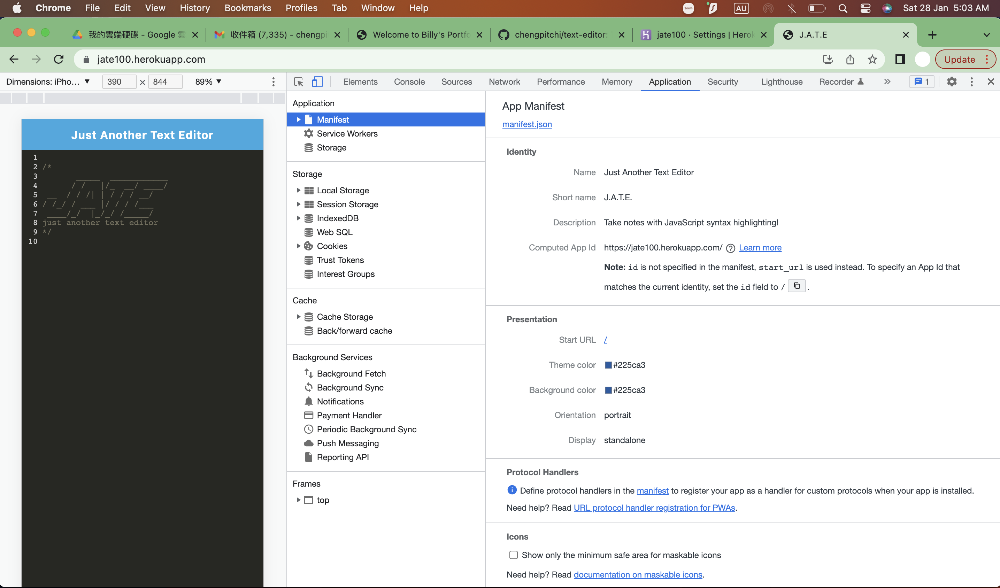
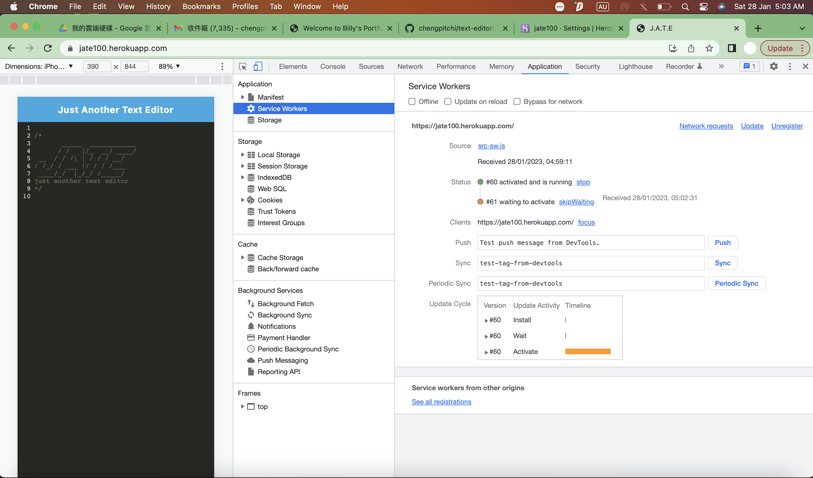
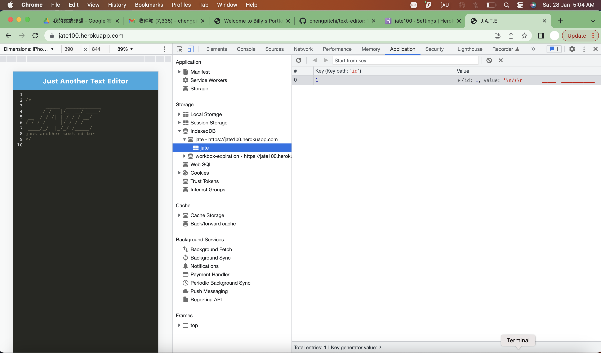
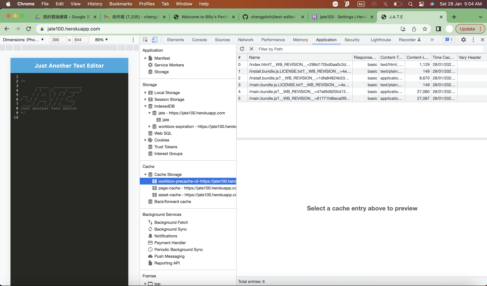
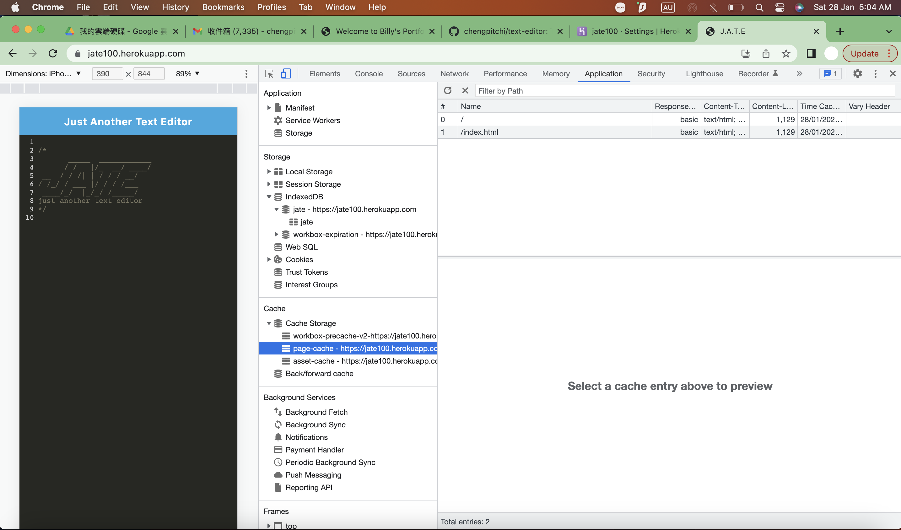
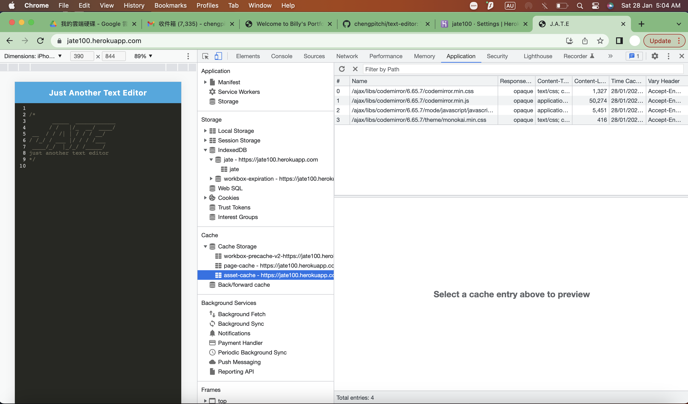
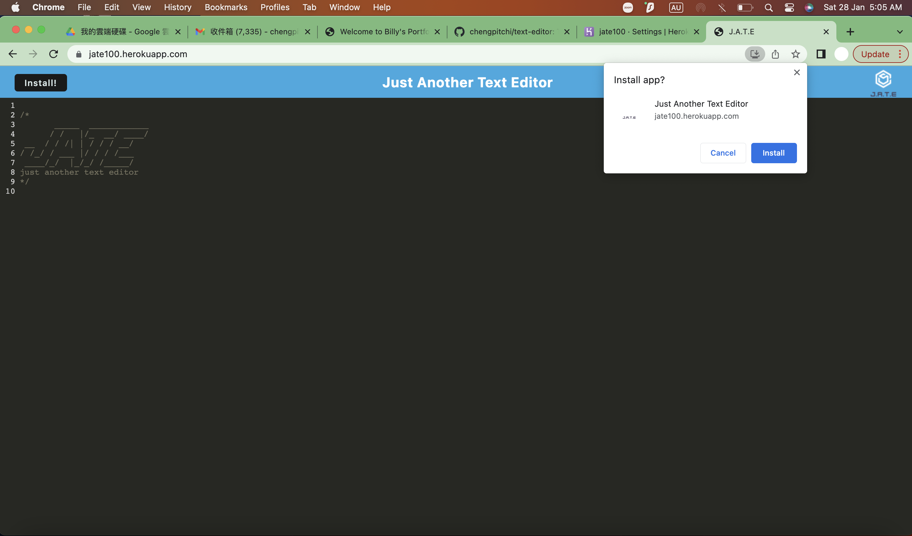
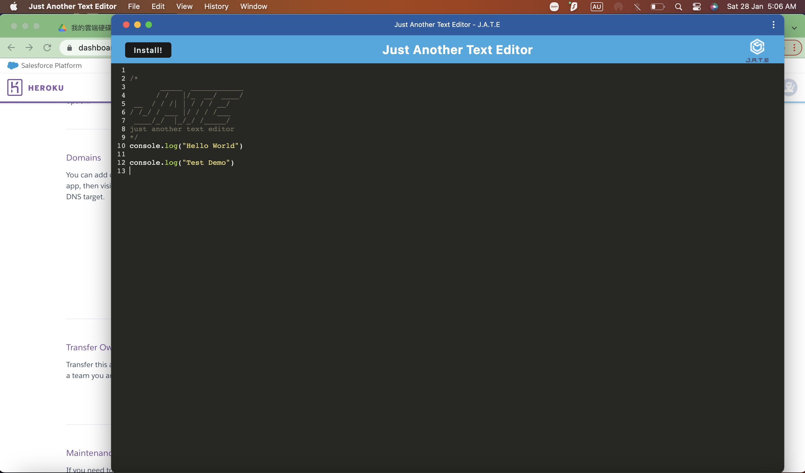
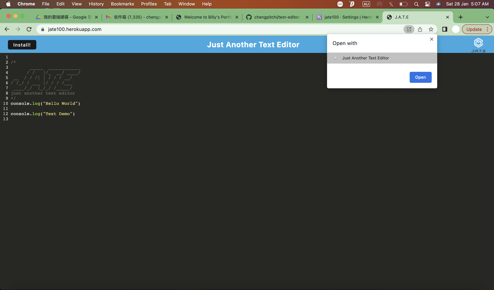
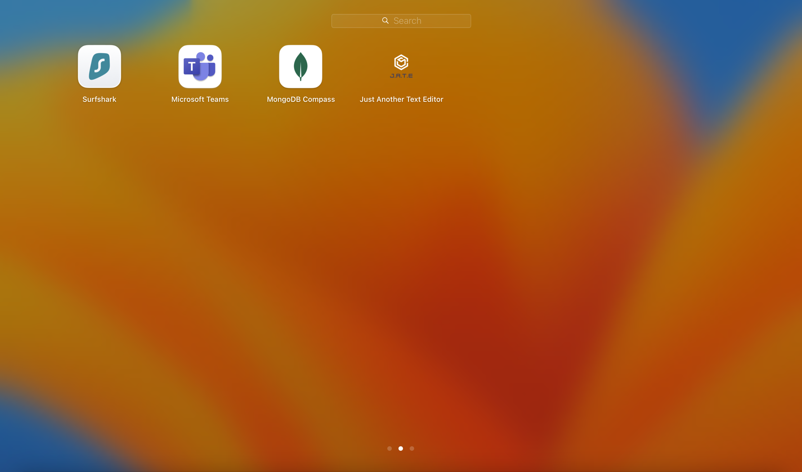

# Just Another Text Editor (J.A.T.E.)

[](https://www.javascript.com)

## Table of Contents
* [Description](#description)
* [User Story](#user-story)
* [Acceptance Criteria](#acceptance-criteria)
* [Installation](#installation)
* [Testing](#testing)
* [Screenshot](#screenshot)
* [Live URL](#live-url)
* [Contributors](#contributors)
* [Questions](#questions)
* [License](#license)

## Description
This application is a text editor that runs in the browser. The app will be a single-page application that meets the PWA criteria. Additionally, it will feature a number of data persistence techniques that serve as redundancy in case one of the options is not supported by the browser. The application will also function offline.

## User Story

```md
AS A developer
I WANT to create notes or code snippets with or without an internet connection
SO THAT I can reliably retrieve them for later use
```

## Acceptance Criteria

```md
GIVEN a text editor web application
WHEN I open my application in my editor
THEN I should see a client server folder structure
WHEN I run `npm run start` from the root directory
THEN I find that my application should start up the backend and serve the client
WHEN I run the text editor application from my terminal
THEN I find that my JavaScript files have been bundled using webpack
WHEN I run my webpack plugins
THEN I find that I have a generated HTML file, service worker, and a manifest file
WHEN I use next-gen JavaScript in my application
THEN I find that the text editor still functions in the browser without errors
WHEN I open the text editor
THEN I find that IndexedDB has immediately created a database storage
WHEN I enter content and subsequently click off of the DOM window
THEN I find that the content in the text editor has been saved with IndexedDB
WHEN I reopen the text editor after closing it
THEN I find that the content in the text editor has been retrieved from our IndexedDB
WHEN I click on the Install button
THEN I download my web application as an icon on my desktop
WHEN I load my web application
THEN I should have a registered service worker using workbox
WHEN I register a service worker
THEN I should have my static assets pre cached upon loading along with subsequent pages and static assets
WHEN I deploy to Heroku
THEN I should have proper build scripts for a webpack application
```

## Installation

1. To setup the application in local, download the repsitory from Github and open the terminal from the root folder.  Run "npm i" to install the below packages from the root, server and client folders. 

    Root folder
    * express 
    * if-env
    * concurrently 
    * nodemon

    Server folder
    * express 
    * nodemon

    Client folder
    * @babel/core
    * @babel/plugin-transform-runtime
    * @babel/preset-env
    * @babel/runtime
    * babel-loader
    * css-loader
    * html-webpack-plugin
    * http-server
    * style-loader
    * webpack
    * webpack-cli
    * webpack-dev-server
    * webpack-pwa-manifest
    * workbox-webpack-plugin

2. After installation, you can run "npm start" to run the build and start the application. 

## Testing
> Application is tested by manual test scripts through the Chrome browser.  

> Open the Chrome browser and check the application tab to verify the manifest, service worker, indexedDB and caching are implemented properly. 

## Screenshot




















## Live URL 
https://jate100.herokuapp.com/

## Contributors
* GitHub: [chengpitchi](https://github.com/chengpitchi)

## Questions
Please send your questions to chengpitchi@yahoo.com or visit [github/chengpitchi](https://github.com/chengpitchi).

## License
N/A